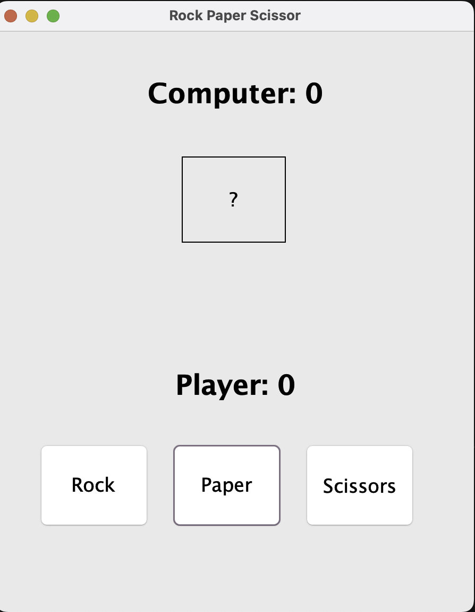
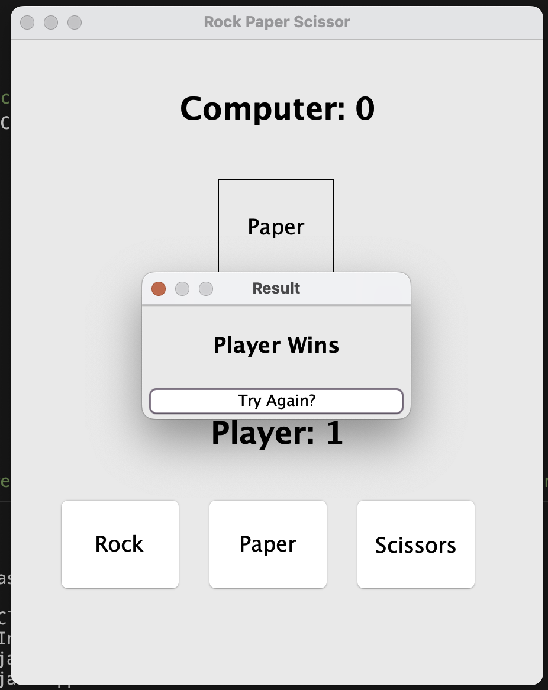

# ✊🖐✌️ Rock Paper Scissors Game (Java Swing)

Welcome to the classic **Rock Paper Scissors** game built with **Java Swing**!  
Challenge the computer and test your luck! 🎲🎮

---

## 🖼️ GUI Preview
A clean and simple GUI with buttons for Rock, Paper, and Scissors, and a display for the computer's choice and scores.

---

## 📁 Project Structure

```
📦 RockPaperScissors
├── RockPaperScissor.java         # 🎮 Game logic (backend)
├── RockPaperScissorGUI.java      # 🖼️ GUI and user interaction (frontend)
└── App.java                      # 🚀 Main class to launch the game
```

---

## 🚀 How to Run

1. **Clone or download** this repository.

2. **Compile the Java files:**

```bash
javac App.java RockPaperScissorGUI.java RockPaperScissor.java
```

3. **Run the game:**

```bash
java App
```

---

## 🕹️ Gameplay Instructions

- Click one of the buttons: **Rock**, **Paper**, or **Scissors**.
- The computer makes a random move.
- A dialog shows the result:  _Player Wins_,  _Computer Wins_, or  _Draw_.
- Scores are updated after each round.
- Click **"Try Again?"** to continue playing.

---

## ⚙️ Technologies Used

- ☕️ Java
- 🖥️ Java Swing (GUI)
- 🎲 Random class for computer moves

---

## 🎯 Features

- ✅ Simple and intuitive interface
- ✅ Score tracking for both player and computer
- ✅ Responsive dialog messages
- ✅ Fully standalone desktop app

---

## 📸 Screenshot 

> Here is a screenshot of my project!_  
>
>


---
## 💡 What I learnt from this project
i. Basics of JFrame<br>
ii. Abstract Window Toolkit<br>
iii. Awt EventListener<br>
---

## 🙌 Credits

Made with java ☕️ and by Sachin

---
